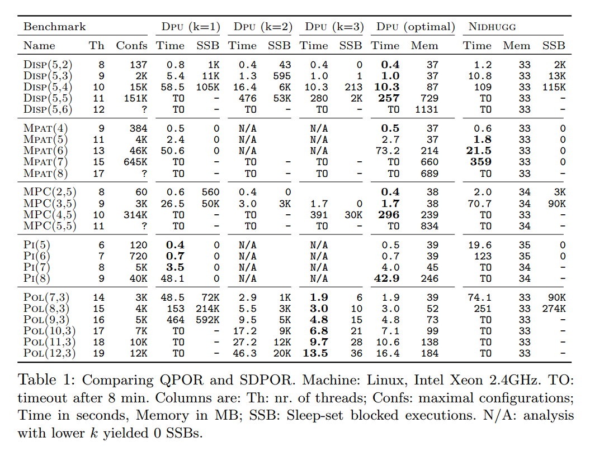
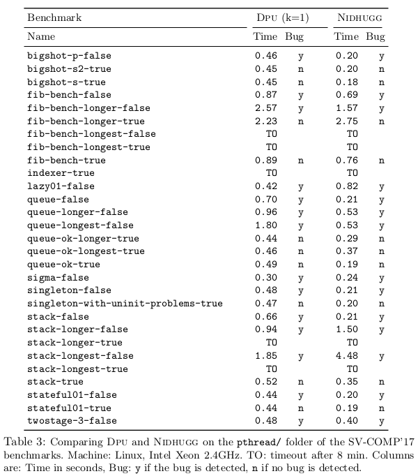

CAV'18 Paper Experiments
========================

This folder contains all the necessary scripts to reproduce the experimental
results of the TACAS'18 paper submission.

Table 1: Comparison between QDPOR and SDPOR
-------------------------------------------

In order to build Table 1 from the paper (shown below), just run::

  make table1

This will execute the script ``runtable1.sh``, which in turn will
generate a folder inside of the folder ``table1`` with multiple log files.

After running the script please refer to the following generated files:

- ``table1/logs/OUTPUT.rst``: the main log.
- ``table1/logs/TABLE.tex``: a LaTeX table generated out of the log.

As a sample, we include these two files as generated in the same machine where
we have run the experiments for the paper:

- `<table1/OUTPUT.rst>`__
- `<table1/TABLE.tex>`__

Although run times and memory consumption sizes are not identical to those
shown in the paper, observe that the variations are usually quite small.
For the record, the table as presented in the paper looked like this:

Table 2: Debian Experiments
---------------------------

Currently all data is in the file ``maple-exp.tar.gz``.
I will expand this README here in a couple of days.

Table 3: Experiments with the SVCOMP'17 Benchmarks
--------------------------------------------------

In order to build Table 3 from the paper (shown below), just run::

  make table3

